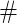

**phon_rule** is a user-friendly LaTeX environment for typsetting phonological rules.

### Table of Contents

1\.  [Introduction](#introduction)  
2\.  [Using the `phon_rule` Environment](#usingthe`phon_rule`environment)
3\.  [The `center` Option](#the`center`option)
4\.  [Examples](#examples)  

### 1\. Introduction

I couldn't find a good LaTeX environment for phonological rules, so I wrote my own. The
phon_rule environment aims to be as simple to use as possible, while still being flexible
in the types of rules it can draw.

To use this environment, place the `phon_rule.sty` file either in your LaTeX packages directory or in the same directory as the
document you're going to use the environment in. 

Most of the LaTeX in this readme was automatically rendered using [markdown-pp](https://github.com/AlexNisnevich/markdown-pp)
by way of [QuickLaTeX](http://www.holoborodko.com/pavel/quicklatex/). Because QuickLaTeX does not yet support the `tipa` package, 
any IPA symbols in this readme are approximations using the closest available LaTeX symbol.

### 2\. Using the `phon_rule` Environment

The basic format of a phonological rule is:

	\begin{phon_rule}
		A \> B \/ C \_ D
	\end{phon_rule}

which produces

Each element of the rule can be composed of the following:

- `\cv{V}`: a CV-tier or tonal-tier element

	- 

- `\phoneme{S}`: an IPA phoneme, using the `tipa` library

	- 

- `\phone{S}`: as above, but displayed with phonetic brackets

	- ![[\int]](readme-images/sh-phone.png)

- `\features{\f{+}{stop} \f{+}{alv.}}`, a feature matrix, where each `\f{+/-}{name}` is a feature

	- 

- `\cvfeatures{C}{\f{\alpha}{place}}`: as above, but with a CV-tier element above the feature matrix

	- 

- `\oneof{\# \\ \cv{C}}`, a set of possible environments

	- 

- `\#`: a word-boundary marker

	- 

- `\null`: a null symbol

	- 

### 3\. The `center` Option

Invoking the `center` option when using the package wraps the rules (the `phon_rule` environment) in a `center` environment, centering them. 

### 4\. Examples

Examples of phonological rules are found in the body of `phon_rule.tex`, and their output can be seen in `phon_rule.pdf`.
